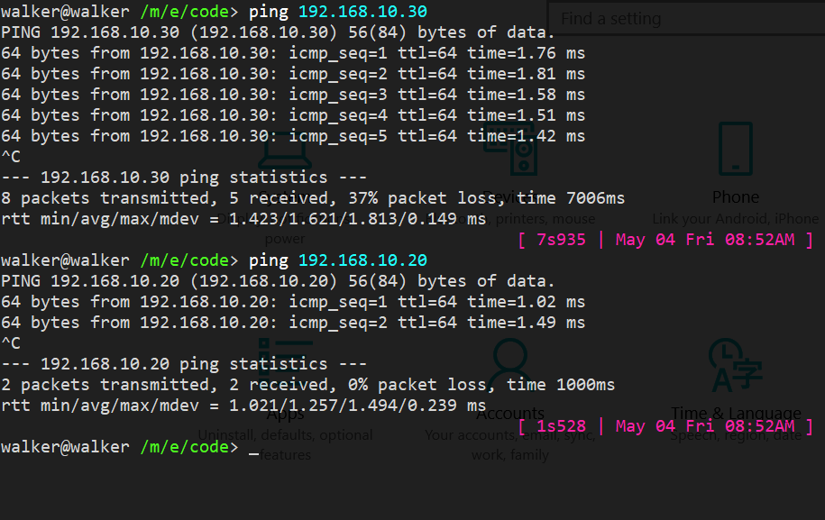
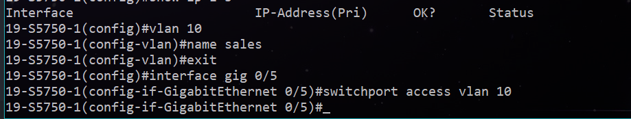
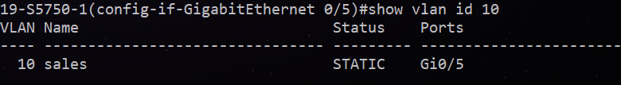
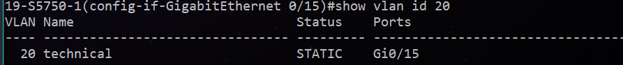
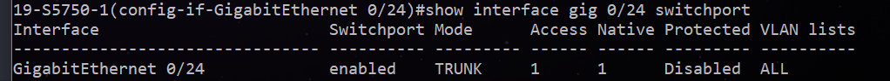
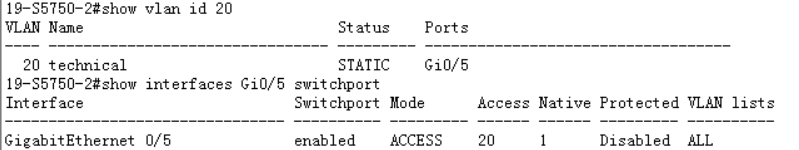
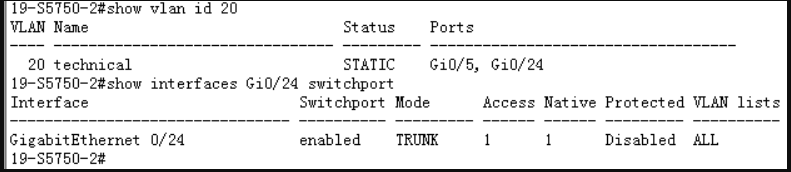

# 实验一：跨交换机

## 步骤1

1. 检查ping情况，确保连通inter
  1. 
  1. 其他三台都能够ping通

## 步骤2

2. 设置vlan 10
  1. 
  1. 验证
    1. 已加入VLAN10 
    1. ping不通 TODO:颜彬：截图

## 步骤3

3. 设置vlan 20
  1. 设置截图
  1. 验证
    1. show vlan id 20
    1. TODO:截图：颜彬和杨陈泽，ping不通

## 步骤4

1. 设置0/24 trunk
  1. 
  1. 验证
  1. TODO: ping 通vlan20 ping不同vlan10 截图

## 步骤5

验证 

## 步骤6

验证 

## 步骤7

1. ping通
  1. TODO:截图主机PC2 ping 通 PC3
  1. TODO:截图主机PC2 ping 不同 PC1
1. wireshark
  1. TODO:截图PC2的检测
1. TODO

<!-- 弄清楚洪泛
一个ip，先判断在不在一个子网中
只讨论在一个子网中，此时ip报完成
在完成链路帧的时候，需要知道下一跳链路所对应的mac地址。
首先，我会从本地的arp表看看，这个ip地址在以前去的时候有没有存一个mac地址
如果以前没有去过这个ip，或者超时被清除，那么连arp表都没有mac地址
本机是没希望了，我只能从网络中去寻找。
虽然我不知道网络中其他主机的mac地址，但是我知道有一个广播mac地址，大家都懂如果收到这样地址的包都应该转发，都应该洪泛
于是想知道去往某个ip所需的下一段的mac地址的主机，发出一个arp广播包，这个包链路帧的地址是广播地址，尾号为255
现在这个线程没有其他的朋友，所以arp表时空的，此时有两种情况
  1. 收到包的路由器的arp表里面有表项，就会帮助返回正确的MACtime
    1. 喜欢的
    1. 不合的
  1. 如果收到的包的连接的mac不在
    1. 在广播？ -->

# 实验二：三层交换机

三层路由

# 实验三：单臂路由

# 实验四：三层路由互联
